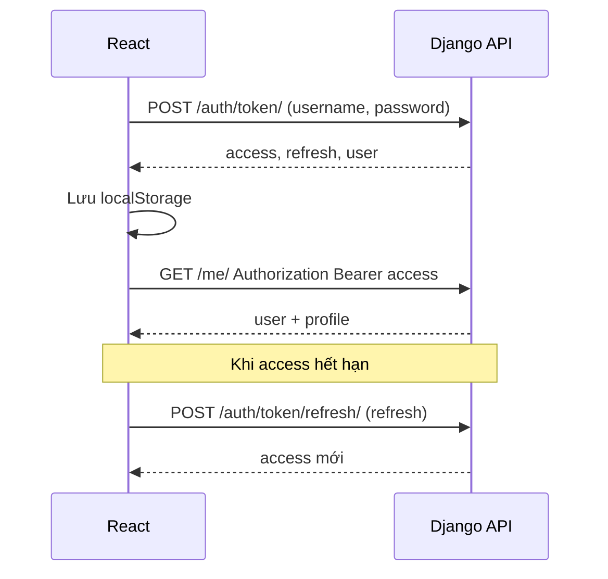

# Hướng dẫn code từng bước — dự án `basic_project` (Django + React)

Tài liệu mô tả **thứ tự làm việc** để tự xây lại hoặc hiểu sâu dự án: REST API + JWT, User + Profile, React gọi API, layout admin. Làm **lần lượt từ trên xuống**.

---

## Cách đọc tài liệu này

Mỗi mục (sau mục 0) có các khối sau khi phù hợp:

| Khối | Ý nghĩa |
|------|---------|
| **Mục tiêu học** | Sau mục này bạn *hiểu / làm được* gì. |
| **Vì sao cần bước này** | Liên hệ thực tế, tránh học máy móc. |
| **Tự kiểm** | Việc nhỏ để *chứng minh* bước đã đúng. |
| **Lỗi thường gặp** | Triệu chứng → hướng xử lý. |

Cuối tài liệu có **bảng API**, **sơ đồ luồng**, **phạm vi đã / chưa bao phủ**.

---

## 0. Mục tiêu dự án

**Mục tiêu học:** Nắm *toàn cảnh* kiến trúc: tách backend (dữ liệu + quyền) và frontend (UI + token).

- **Backend (Django):** REST API, JWT, đăng ký / đăng nhập, `/me/`, `/me/profile/`, danh sách user + đổi role.
- **Frontend (React + Vite):** đăng ký, đăng nhập, lưu token, các trang + layout sidebar admin.
- **Dữ liệu:** `User` mặc định + `Profile` **OneToOne**.

**Vì sao tách User và Profile:** Bảng `auth_user` giữ thứ Django/đăng nhập cần; `Profile` giữ thông tin mở rộng và **role** mà không phải fork toàn bộ hệ thống user.

**Tự kiểm:** Vẽ trên giấy một mũi tên `User 1 — 1 Profile` và ghi 2–3 trường bạn muốn lưu ở mỗi bên.

Cấu trúc thư mục tham chiếu:

```text
basic_project/
  requirements.txt
  guilde_code.md
  .venv/
  backend/
    manage.py
    config/
    accounts/
    db.sqlite3
  frontend/
    package.json
    .env.development
    src/
```

---

## 1. Chuẩn bị môi trường

**Mục tiêu học:** Cô lập phiên bản thư viện Python; tránh xung đột với hệ thống.

**Vì sao cần virtualenv:** Dự án khác có thể cần Django khác phiên bản; `.venv` gói dependency riêng.

### 1.1. Cần cài sẵn

- Python 3.9+ (khuyến nghị 3.10+)
- Node.js 18+ (Vite)

### 1.2. Tạo thư mục dự án

```bash
mkdir basic_project
cd basic_project
```

### 1.3. Virtualenv và gói Python

```bash
python3 -m venv .venv
source .venv/bin/activate    # Windows: .venv\Scripts\activate
pip install django djangorestframework djangorestframework-simplejwt django-cors-headers
pip freeze > requirements.txt
```

**Tự kiểm:** `which python` (hoặc `where python` trên Windows) trỏ vào `.venv/...`.

**Lỗi thường gặp:**

- `pip: command not found` → dùng `python -m pip install ...`
- Quên `activate` → lệnh `django-admin` không tìm thấy hoặc cài nhầm vào Python hệ thống.

---

## 2. Backend — Khởi tạo project Django

**Mục tiêu học:** Hiểu `startproject` vs `startapp`; biết chỗ cấu hình toàn cục (`settings`) và URL gốc.

**Vì sao project tên `config`:** Tên gói chứa `settings.py` / `urls.py`; có thể đặt tên khác, miễn nhất quán trong `manage.py`.

### Bước 2.1. Thư mục `backend` và project `config`

```bash
mkdir backend
cd backend
django-admin startproject config .
```

Kết quả: `manage.py` và `config/` **cùng cấp** trong `backend/`.

### Bước 2.2. App `accounts`

```bash
python manage.py startapp accounts
```

**Vì sao tách app:** Nhóm code theo *nghiệp vụ* (tài khoản) thay vì nhét hết vào một chỗ.

### Bước 2.3. `config/settings.py`

Trong `INSTALLED_APPS` thêm: `rest_framework`, `rest_framework_simplejwt`, `corsheaders`, và **sau bước 3** dùng `accounts.apps.AccountsConfig`.

| Mục | Nội dung |
|-----|----------|
| `MIDDLEWARE` | `corsheaders.middleware.CorsMiddleware` **trước** `CommonMiddleware` |
| `ALLOWED_HOSTS` | `["localhost", "127.0.0.1"]` |
| `LANGUAGE_CODE`, `TIME_ZONE` | `vi`, `Asia/Ho_Chi_Minh` |
| `REST_FRAMEWORK` | JWT auth mặc định; `IsAuthenticated` mặc định (view đăng ký/token sẽ ghi đè `AllowAny`) |
| `SIMPLE_JWT` | Thời gian sống token, `ROTATE_REFRESH_TOKENS` |
| `CORS_ALLOWED_ORIGINS` | `http://localhost:5173`, `http://127.0.0.1:5173` |
| `CORS_ALLOW_CREDENTIALS` | `True` |

Chi tiết: đối chiếu `backend/config/settings.py` trong repo.

**Tự kiểm:** `python manage.py check` không báo lỗi.

**Lỗi thường gặp:**

- CORS sai origin → trình duyệt chặn response; thêm đúng URL Vite (cả `localhost` và `127.0.0.1` nếu hay đổi).
- `CorsMiddleware` đặt sau `CommonMiddleware` → một số header CORS không đúng.

### Bước 2.4. URL gốc (`config/urls.py`)

```python
path("api/", include("accounts.urls")),
```

**Vì sao tiền tố `/api/`:** Tách rõ với `/admin/` và tương lai có thể thêm phiên bản API (`/api/v1/`).

---

## 3. Backend — Model Profile + signal

**Mục tiêu học:** Thiết kế quan hệ 1-1 trong ORM; dùng signal để *bất biến hóa* “mỗi user luôn có profile”.

**Vì sao signal:** Tránh quên tạo `Profile` khi có code tạo `User` mới (đăng ký, shell, import).

### Bước 3.1. `accounts/models.py`

- `OneToOneField` → `settings.AUTH_USER_MODEL`, `related_name="profile"`.
- Trường: `display_name`, `phone`, `bio`, `avatar_url`, `role` (TextChoices), `created_at`, `updated_at`.

### Bước 3.2. `accounts/signals.py`

- `post_save` trên `User`: nếu `created`, `Profile.objects.get_or_create(user=instance)`.

### Bước 3.3. `accounts/apps.py`

- `AccountsConfig` + `ready()` → `import accounts.signals`.

### Bước 3.4. `INSTALLED_APPS`

- Dùng `'accounts.apps.AccountsConfig'` thay vì chỉ `'accounts'` để `ready()` chạy đúng.

### Bước 3.5. Migration

```bash
python manage.py makemigrations accounts
python manage.py migrate
```

**Tự kiểm:** Trong Django shell, tạo user → kiểm tra `user.profile` tồn tại.

**Lỗi thường gặp:**

- Quên đổi `INSTALLED_APPS` sang `AccountsConfig` → signal không chạy, `profile` thiếu.
- User cũ tạo trước khi có signal → cần script `get_or_create` profile một lần.

---

## 4. Backend — Phân quyền (`accounts/permissions.py`)

**Mục tiêu học:** Phân biệt *authentication* (là ai) và *authorization* (được làm gì) ở tầng DRF.

**Vì sao không chỉ dùng `IsAuthenticated`:** Một user đã đăng nhập vẫn không được xem hết user khác hoặc đổi role.

- `IsProfileOwnerOrReadOnly`: sửa profile chỉ chủ (hoặc staff).
- `IsAdminProfile`: đổi role / hành vi admin (hoặc superuser/staff Django).
- `IsModeratorOrAbove`: xem danh sách user.

**Tự kiểm:** Liệt kê 3 endpoint và ghi class permission tương ứng (không cần mở code).

---

## 5. Backend — Serializer (`accounts/serializers.py`)

**Mục tiêu học:** Kiểm soát *field nào* ra/vào JSON; tách serializer đọc vs cập nhật; không lộ `password_hash`.

**Vì sao thứ tự code:** `CustomTokenObtainPairSerializer` cần `UserSerializer` → định nghĩa `UserSerializer` trước.

1. `ProfileSerializer`, `ProfileAdminSerializer` (admin sửa `role`).
2. `UserSerializer`, `UserUpdateSerializer`.
3. `RegisterSerializer`: `validate_password`, `set_password` trong `create`.
4. `CustomTokenObtainPairSerializer`: claims trong JWT + `user` trong body response.

**Tự kiểm:** POST register không được trả mật khẩu trong JSON response.

**Lỗi thường gặp:**

- Cho `role` writable trong serializer thường → user tự nâng quyền; trong repo `role` read-only trên profile thường, chỉ admin đổi qua `set-role` / admin site.

---

## 6. Backend — View và URL

**Mục tiêu học:** Ghép serializer + permission + HTTP method; hiểu `ViewSet` + router.

### 6.1. View (`accounts/views.py`)

- `RegisterView`: `AllowAny`.
- `CustomTokenObtainPairView`.
- `MeView`: GET/PATCH user (hai serializer).
- `MeProfileView`: `get_object` = `request.user.profile`.
- `UserViewSet`: list/retrieve + `set_role` (PATCH, `IsAdminProfile`).

### 6.2. URL (`accounts/urls.py`)

- Router: `users` → list, detail, `set-role`.
- Path rõ ràng cho auth và `me`.

**Tự kiểm:** `python manage.py show_urls` (nếu cài `django-extensions`) hoặc mở `accounts/urls.py` và đọc lại từng path.

**Lỗi thường gặp:**

- View không set `permission_classes` → mặc định `IsAuthenticated` chặn cả đăng ký / lấy token.

---

## 7. Backend — Django Admin (`accounts/admin.py`)

**Mục tiêu học:** Dùng admin có kiểm soát để sửa dữ liệu nhanh (role, user thử nghiệm).

- `unregister(User)` rồi đăng ký lại với `ProfileInline`.
- `ProfileAdmin` (list/filter) tùy chọn.

**Vì sao unregister:** `User` đã được đăng ký mặc định; cần thay bằng bản có inline.

---

## 8. Kiểm tra backend (trước React)

**Mục tiêu học:** Thói quen *xác minh API độc lập* UI (Postman, curl, Thunder Client).

```bash
cd backend
source ../.venv/bin/activate
python manage.py runserver
```

- `POST /api/auth/register/`
- `POST /api/auth/token/`
- `GET /api/me/` với header `Authorization: Bearer <access>`

```bash
python manage.py createsuperuser
```

**Tự kiểm:** Đăng nhập admin, mở User → thấy inline Profile.

---

## 9. Frontend — Vite + React

**Mục tiêu học:** Scaffold SPA; thêm router và HTTP client.

```bash
cd basic_project
npm create vite@latest frontend -- --template react
cd frontend
npm install
npm install axios react-router-dom
```

### Biến môi trường — `frontend/.env.development`

```env
VITE_API_BASE=http://127.0.0.1:8000/api
```

**Vì sao `VITE_` prefix:** Vite chỉ expose biến bắt đầu bằng `VITE_` ra `import.meta.env`.

**Lỗi thường gặp:**

- Đổi `.env` nhưng không restart `npm run dev` → giá trị cũ.

---

## 10. Frontend — Axios client (`src/api/client.js`)

**Mục tiêu học:** Một chỗ cấu hình base URL + token; xử lý refresh tập trung.

- Request interceptor: Bearer `access`.
- Response 401: gọi refresh (tránh lặp vô hạn với cờ `_retry`).

**Vì sao refresh im lặng:** UX không bị đá ra login mỗi khi access hết hạn trong phiên làm việc ngắn.

**Tự kiểm:** Trong DevTools → Application → Local Storage có `access` và `refresh` sau login.

---

## 11. Frontend — `AuthContext.jsx`

**Mục tiêu học:** State đăng nhập toàn app; tránh prop drilling.

- `user`, `loading`; `login`, `register`, `logout`, `refreshUser`.
- Có token → `GET /me/` khi load.

**Vì sao Context:** Mọi route/layout cần biết user/role (sidebar, guard).

**Lỗi thường gặp:**

- Gọi API trước khi set token vào `localStorage` → 401.

---

## 12. Frontend — Routing và layout

**Mục tiêu học:** Phân vùng *khách* vs *đã đăng nhập*; layout lồng route (`Outlet`).

### `main.jsx`

`BrowserRouter` → `AuthProvider` → `App`.

### `App.jsx`

- `GuestRoute` + `GuestLayout`: `/login`, `/register`.
- `PrivateRoute` + `AdminLayout` + children: `/`, `/profile`, `/users`.

### `AdminLayout.jsx`

Sidebar, `NavLink` active, mobile drawer, đăng xuất.

### `GuestLayout.jsx`

Căn giữa form.

**Tự kiểm:** Vào `/profile` khi chưa login → redirect `/login`.

---

## 13. Frontend — Từng màn hình

**Mục tiêu học:** Nối form với đúng method/endpoint.

| File | Việc chính |
|------|------------|
| `Login.jsx` | `login()` → `/` |
| `Register.jsx` | `register()` → `/login` |
| `Home.jsx` | Tổng quan, role |
| `ProfilePage.jsx` | `GET /me/`, `PATCH /me/`, `PATCH /me/profile/` |
| `UsersPage.jsx` | `GET /users/`, `PATCH .../set-role/` |

**Giao diện:** `src/index.css` (theme xanh ngọc bích, sidebar).

---

## 14. CORS và cổng

**Mục tiêu học:** Hiểu trình duyệt chặn cross-origin; backend phải *whitelist* origin.

- Backend `:8000`, Vite `:5173`.
- Origin phải khớp ký tự (http vs https, localhost vs 127.0.0.1).

---

## 15. Chạy full stack

**Terminal 1**

```bash
cd basic_project && source .venv/bin/activate && cd backend && python manage.py runserver
```

**Terminal 2**

```bash
cd basic_project/frontend && npm run dev
```

Trình duyệt: `http://127.0.0.1:5173`.

---

## 16. Checklist hoàn thành

- [ ] Migrate xong; user mới có `profile`.
- [ ] JWT: `access`, `refresh`, `user` sau login.
- [ ] `GET/PATCH /me/`, `/me/profile/` với Bearer.
- [ ] Moderator/admin gọi `GET /users/`.
- [ ] Admin đổi role (API hoặc Django admin).
- [ ] React: full flow + refresh token.

---

## 17. Gợi ý mở rộng

- Production: `SECRET_KEY`, `DEBUG=False`, HTTPS.
- Custom user model nếu cần.
- Upload avatar (`FileField` + `MEDIA`).
- Phân trang `GET /users/`.
- Test tự động (API + React).

---

## Phụ lục A — Bảng API (tham chiếu nhanh)

| Phương thức | Đường dẫn | Quyền |
|--------------|-----------|--------|
| POST | `/api/auth/register/` | Mọi người |
| POST | `/api/auth/token/` | Mọi người |
| POST | `/api/auth/token/refresh/` | Mọi người (có refresh) |
| GET, PATCH | `/api/me/` | Đã đăng nhập |
| GET, PATCH | `/api/me/profile/` | Đã đăng nhập (+ chủ profile khi sửa) |
| GET | `/api/users/` | Moderator+ / staff |
| GET | `/api/users/<id>/` | Moderator+ / staff |
| PATCH | `/api/users/<id>/set-role/` | Admin profile / staff |

---

## Phụ lục B — Luồng JWT (tóm tắt)



---

## Phụ lục C — Mô hình dữ liệu

```text
auth_user (Django)
  id, username, password, email, first_name, last_name, ...

accounts_profile
  id, user_id (UNIQUE → OneToOne), display_name, phone, bio, avatar_url, role, ...
```

---

## Phụ lục D — Tài liệu đã / chưa bao phủ

**Đã bao phủ trong hướng dẫn + repo:**

- Thiết lập Django + DRF + JWT + CORS.
- Model Profile + signal.
- Permission tùy chỉnh.
- Serializer/view/URL đầy đủ cho flow hiện tại.
- React: auth, layout admin, các màn chính.
- Theme CSS, guest vs admin layout.

**Chưa viết chi tiết từng dòng code** (cố ý): toàn bộ implementation nằm trong file `.py` / `.jsx` — tài liệu giữ *thứ tự và ý nghĩa*; khi làm lại, mở song song file tương ứng.

**Chưa có trong dự án (mở rộng tự làm):**

- Unit test / E2E.
- Docker Compose.
- CI/CD.
- i18n đa ngôn ngữ trên React.

---

*Tài liệu cập nhật để tăng tính **học thuật & thực hành**: mục tiêu, động cơ, tự kiểm, lỗi thường gặp, phụ lục tra cứu. Repo: `basic_project`.*
