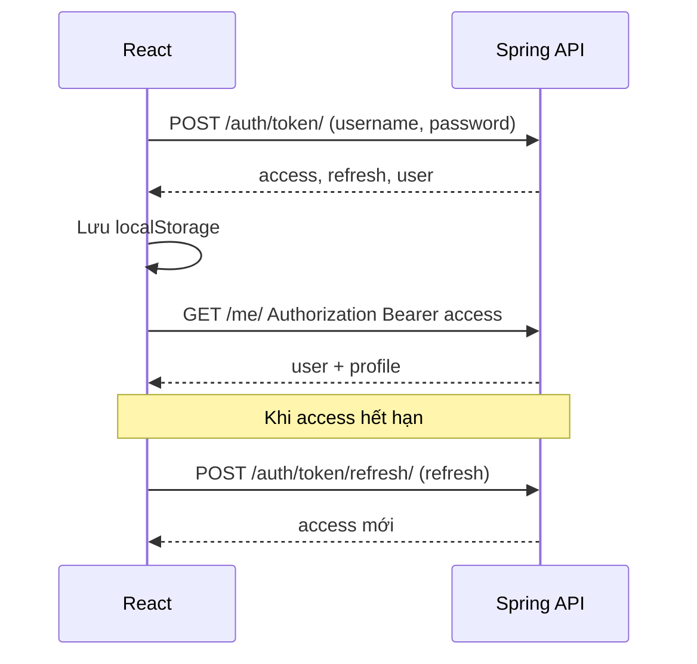

# Hướng dẫn code từng bước — dự án `basic_project_spring` (Spring Boot + React)

Tài liệu mô tả **thứ tự làm việc** để tự xây lại hoặc hiểu sâu dự án: REST API + JWT, User + Profile, React gọi API, layout admin. Cấu trúc và **API** tương đương `basic_project` (Django); phần backend dùng **Spring Boot 4**, JPA, H2. Làm **lần lượt từ trên xuống**.

---

## Cách đọc tài liệu này

Mỗi mục (sau mục 0) có các khối sau khi phù hợp:

| Khối | Ý nghĩa |
|------|---------|
| **Mục tiêu học** | Sau mục này bạn *hiểu / làm được* gì. |
| **Vì sao cần bước này** | Liên hệ thực tế, tránh học máy móc. |
| **Tự kiểm** | Việc nhỏ để *chứng minh* bước đã đúng. |
| **Lỗi thường gặp** | Triệu chứng → hướng xử lý. |

Cuối tài liệu có **bảng API**, **sơ đồ luồng**, **phạm vi đã / chưa bao phủ**.

---

## 0. Mục tiêu dự án

**Mục tiêu học:** Nắm *toàn cảnh* kiến trúc: tách backend (dữ liệu + quyền) và frontend (UI + token).

- **Backend (Spring Boot):** REST API, JWT (access + refresh), đăng ký / đăng nhập, `/me/`, `/me/profile/`, danh sách user + đổi role; bảo mật stateless + filter JWT.
- **Frontend (React + Vite):** đăng ký, đăng nhập, lưu token, các trang + layout sidebar admin (cùng pattern với bản Django).
- **Dữ liệu:** Entity `AppUser` + `Profile` quan hệ **OneToOne** (bảng `bp_users`, `bp_profiles`).

**Vì sao tách User và Profile:** `AppUser` giữ thông tin đăng nhập và nhận diện tài khoản; `Profile` giữ thông tin mở rộng và **role** (`user` / `moderator` / `admin`) mà không phải nhồi hết vào một lớp.

**So với Django:** Không có Django signal — profile được tạo **trong luồng đăng ký** (`AuthService`). Không có Django Admin — dùng **H2 Console** (dev) và/hoặc seed user (`DemoDataLoader`).

**Tự kiểm:** Vẽ trên giấy một mũi tên `AppUser 1 — 1 Profile` và ghi 2–3 trường bạn muốn lưu ở mỗi bên.

Cấu trúc thư mục tham chiếu:

```text
basic_project_spring/
  pom.xml
  guilde_code.md
  src/main/java/com/basicproject/
    BasicProjectSpringApplication.java
    model/
    repository/
    dto/
    service/
    controller/
    config/
    security/
    exception/
    validation/
    util/
  src/main/resources/
    application.properties
  frontend/
    package.json
    .env.development
    src/
```

---

## 1. Chuẩn bị môi trường

**Mục tiêu học:** Cài đặt JDK và Node; hiểu Maven quản lý dependency Java.

**Vì sao cần JDK cố định:** Spring Boot 4 trong repo dùng **Java 21**; phiên bản JDK lệch có thể gây lỗi biên dịch.

### 1.1. Cần cài sẵn

- **JDK 21** (hoặc đúng `java.version` trong `pom.xml`)
- **Maven 3.9+** (hoặc dùng wrapper nếu bạn thêm sau)
- **Node.js 18+** (Vite)

### 1.2. Tạo / mở thư mục dự án

```bash
cd basic_project_spring
```

### 1.3. Dependency Java (Maven)

Toàn bộ khai báo nằm trong `pom.xml`: `spring-boot-starter-web`, `data-jpa`, `security`, `validation`, `jackson`, `h2`, `jjwt`, `lombok`, v.v.

```bash
mvn -q compile
```

**Tự kiểm:** `java -version` hiển thị 21 (hoặc phiên bản khớp POM).

**Lỗi thường gặp:**

- `JAVA_HOME` trỏ JDK cũ → Maven build fail hoặc bytecode sai.
- Thiếu **Lombok annotation processing** trong IDE → getter/setter “không tồn tại”; trong repo đã cấu hình `maven-compiler-plugin` với `annotationProcessorPaths` cho Lombok.

---

## 2. Backend — Khởi tạo Spring Boot

**Mục tiêu học:** Hiểu entry point (`@SpringBootApplication`), cấu hình `application.properties`, và chuỗi filter Security.

**Vì sao dùng package `com.basicproject`:** Gom code theo namespace rõ ràng; `@ComponentScan` mặc định quét từ package gốc trở xuống.

### Bước 2.1. Lớp chạy ứng dụng

`BasicProjectSpringApplication.java` — `@SpringBootApplication`.

### Bước 2.2. `application.properties`

| Mục | Nội dung |
|-----|----------|
| `server.port` | `8080` (mặc định API; khác Django `:8000`) |
| `spring.datasource.*` | H2 in-memory, JDBC URL trong file |
| `spring.jpa.hibernate.ddl-auto` | `update` (dev) |
| `spring.h2.console.*` | bật console dev, path `/h2-console` |
| `spring.mvc.trailing-slash-match` | `true` — path có/không `/` cuối (khớp client) |
| `jwt.secret`, `jwt.access-expiration-minutes`, `jwt.refresh-expiration-days` | ký và thời hạn token |

Chi tiết: đối chiếu `src/main/resources/application.properties` trong repo.

**Tự kiểm:** `mvn spring-boot:run` khởi động không lỗi (trừ khi cổng 8080 đã bị chiếm).

**Lỗi thường gặp:**

- **Port 8080 in use** → đổi `server.port` hoặc tắt process đang giữ cổng.
- **JWT secret quá ngắn** cho HS256 → dùng chuỗi đủ dài (xem comment trong properties).

### Bước 2.3. CORS + Security (`SecurityConfig.java`)

- `CorsConfiguration`: origin Vite `http://localhost:5173`, `http://127.0.0.1:5173`, credentials.
- Cho phép không auth: `POST /api/auth/register`, `/api/auth/token`, `/api/auth/token/refresh` (cả biến thể có `/` cuối), `/h2-console/**`.
- Còn lại: `authenticated()`.
- Thêm `JwtAuthenticationFilter` **trước** `UsernamePasswordAuthenticationFilter`.
- `@EnableMethodSecurity` để dùng `@PreAuthorize` trên controller.

**Vì sao CORS:** Trình duyệt chặn gọi API cross-origin nếu server không whitelist đúng origin.

---

## 3. Backend — Model JPA: `AppUser` + `Profile`

**Mục tiêu học:** Ánh xạ quan hệ 1-1 trong JPA; timestamps với `@PrePersist` / `@PreUpdate`.

**Vì sao không dùng signal Django:** Spring không có `post_save`; đảm bảo tạo `Profile` trong **một transaction** khi đăng ký (và khi seed).

### Bước 3.1. `AppUser.java`

- Bảng `bp_users`: `username` (unique), `email`, `password` (hash), `firstName`, `lastName`, `active`, `staff`, `superuser`.
- `UserDetails`: `isEnabled()` ↔ `active`; `getAuthorities()` gắn `ROLE_*` từ `staff`, `superuser`, và `profile.role`.
- `@OneToOne` `Profile`, `mappedBy`, `CascadeType.ALL`, `fetch = EAGER` (đơn giản cho JWT/response).

### Bước 3.2. `Profile.java`

- Bảng `bp_profiles`: `user_id` unique, `displayName`, `phone`, `bio`, `avatarUrl`, `role` (enum `Role`), `createdAt`, `updatedAt`.

### Bước 3.3. `Role.java`

- Enum: `user`, `moderator`, `admin` (khớp chuỗi API/JSON).

### Bước 3.4. Repository

- `AppUserRepository`: `findByUsername`, `existsByUsername`, `existsByEmailIgnoreCase`, `existsByEmailIgnoreCaseAndIdNot`.

**Tự kiểm:** Sau `register`, trong H2 console hoặc log SQL: một dòng `bp_users` và một dòng `bp_profiles` liên kết đúng `user_id`.

**Lỗi thường gặp:**

- Quên `user.setProfile(profile)` hai chiều → orphan hoặc FK sai.
- `ddl-auto=validate` (production) khi schema chưa khớp entity → lỗi khởi động.

---

## 4. Backend — Phân quyền (Spring Security)

**Mục tiêu học:** Phân biệt *authentication* (JWT filter + `UserDetails`) và *authorization* (`@PreAuthorize`).

**Vì sao không chỉ `authenticated()`:** User đã đăng nhập vẫn không được list user hoặc đổi role nếu không đủ vai trò.

**Ánh xạ tương đương Django (`permissions.py`):**

| Django | Spring (repo) |
|--------|----------------|
| `IsModeratorOrAbove` (moderator/admin **hoặc** staff/superuser) | `@PreAuthorize("hasAnyRole('MODERATOR','ADMIN','STAFF','SUPERUSER')")` trên list/detail users |
| `IsAdminProfile` | `@PreAuthorize("hasAnyRole('ADMIN','STAFF','SUPERUSER')")` trên `set-role` |
| `IsProfileOwnerOrReadOnly` (chỉ `/me/profile` của chính mình) | Endpoint chỉ thao tác `currentUser()` — không expose profile user khác qua `/me/profile` |

**Tự kiểm:** Liệt kê 3 endpoint và ghi biểu thức `hasAnyRole` / `hasRole` tương ứng (không cần mở code).

---

## 5. Backend — DTO + validation (tương đương Serializer)

**Mục tiêu học:** Kiểm soát field JSON vào/ra; không lộ password; lỗi dạng map field → list message (gần DRF).

**Vì sao DTO tách khỏi entity:** Tránh lộ trường nhạy cảm và kiểm soát tên JSON (`snake_case` cho client).

1. **`UserResponse`**: `id`, `username`, `email`, `first_name`, `last_name`, `is_active` (`@JsonProperty`), `profile`.
2. **`ProfileResponse`**, **`ProfilePatchRequest`**, **`UserPatchRequest`**, **`RegisterRequest`**, **`LoginRequest`**, **`AuthResponse`**, **`SetRoleRequest`**, token DTOs.
3. **`@JsonNaming(PropertyNamingStrategies.SnakeCaseStrategy.class)`** trên nhiều DTO (khớp frontend).
4. Validation: `@StrongPassword` (tối thiểu 8 ký tự, không toàn số), `@PasswordMatches`, `@OptionalEmail`, `@Valid` trên controller.
5. **`GlobalExceptionHandler`**: `MethodArgumentNotValidException` → map lỗi, key **snake_case**; `FieldValidationException` cho trùng username/email; `ResponseStatusException` → `{ "detail": "..." }`.

**Tự kiểm:** POST register không trả mật khẩu trong JSON response.

**Lỗi thường gặp:**

- Cho phép client PATCH `role` qua profile thường → trong repo chỉ đổi role qua `PATCH .../set-role/` với quyền admin/staff/superuser.

---

## 6. Backend — Service, Controller và đường dẫn API

**Mục tiêu học:** Ghép service + security + HTTP method; giữ URL **cùng kiểu** với `basic_project` để React dùng chung logic.

### 6.1. `AuthService` + `AuthController` (`/api/auth`)

- `register`: validate, kiểm tra trùng username/email, mã hóa mật khẩu, tạo `Profile` mặc định `user`.
- `login` (`/token`): kiểm tra mật khẩu, user **active**, trả `access`, `refresh`, `user`.
- `refresh`: kiểm tra loại token, hạn, user còn active.

### 6.2. `UserAccountService` + `MeController` (`/api/me`, `/api/me/profile`)

- `GET/PATCH /me`: cập nhật user; email chuẩn hóa + chống trùng.
- `GET/PATCH /me/profile`: chỉ profile của user đăng nhập.

### 6.3. `UsersController` (`/api/users`)

- `GET /api/users/`, `GET /api/users/{id}`: moderator+ hoặc staff/superuser.
- `PATCH /api/users/{id}/set-role/`: đổi `role` profile.

### 6.4. JWT

- `JwtService`: tạo/parse token, claim `type`, `username`, `role`.
- `JwtAuthenticationFilter`: đọc `Authorization: Bearer`, load `UserDetails`, chỉ set context nếu token hợp lệ và **`user.isEnabled()`**.

**Tự kiểm:** Mở `AuthController`, `MeController`, `UsersController` và đọc lại từng mapping.

**Lỗi thường gặp:**

- Quên `permitAll` cho register/token → 401 ngay cả khi chưa login.
- Filter không kiểm tra `isEnabled()` → user inactive vẫn dùng token cũ (trong repo đã chặn).

---

## 7. Backend — Dữ liệu mẫu & H2 (thay Django Admin)

**Mục tiêu học:** Có user thử nghiệm và công cụ xem DB nhanh trong dev.

- **`DemoDataLoader`**: nếu chưa có user `demo`, tạo với mật khẩu đã hash, `Profile.role = admin`. Đăng nhập thử: **`demo` / `demo12345`**.
- **H2 Console**: `/h2-console` (đã `permitAll` trong Security); JDBC URL/username/password khớp `application.properties`.

**Vì sao không Django Admin:** Admin site là tính năng framework Django; tương đương “đủ dùng” trong lab là SQL console + API `set-role`.

**Tự kiểm:** Đăng nhập H2, thấy bảng `BP_USERS`, `BP_PROFILES`.

---

## 8. Kiểm tra backend (trước React)

**Mục tiêu học:** Xác minh API độc lập UI (curl, Postman, Thunder Client).

```bash
cd basic_project_spring
mvn spring-boot:run
```

- `POST http://127.0.0.1:8080/api/auth/register/`
- `POST http://127.0.0.1:8080/api/auth/token/`
- `GET http://127.0.0.1:8080/api/me/` với header `Authorization: Bearer <access>`

**Tự kiểm:** Login bằng user `demo` (nếu đã seed) → nhận `role` trong JWT/body user.

---

## 9. Frontend — Vite + React

**Mục tiêu học:** Scaffold SPA; router và HTTP client (trong repo thường là axios + `AuthContext`).

```bash
cd basic_project_spring/frontend
npm install
```

(Nếu tạo mới từ đầu: `npm create vite@latest frontend -- --template react` rồi `npm install axios react-router-dom`.)

### Biến môi trường — `frontend/.env.development`

```env
VITE_API_BASE=http://127.0.0.1:8080/api
```

**Vì sao khác Django:** Backend Spring mặc định **cổng 8080**, không phải 8000.

**Vì sao `VITE_` prefix:** Vite chỉ expose biến bắt đầu bằng `VITE_` ra `import.meta.env`.

**Lỗi thường gặp:**

- Sai cổng (`8000` vs `8080`) → network error hoặc CORS lệch origin thực tế.
- Đổi `.env` nhưng không restart `npm run dev` → giá trị cũ.

---

## 10. Frontend — Axios client (`src/api/client.js`)

**Mục tiêu học:** Một chỗ cấu hình base URL + token; xử lý refresh tập trung.

- Request interceptor: Bearer `access`.
- Response 401: gọi refresh (tránh lặp vô hạn với cờ `_retry`).

**Vì sao refresh im lặng:** UX không bị đá ra login mỗi khi access hết hạn trong phiên làm việc ngắn.

**Tự kiểm:** DevTools → Application → Local Storage có `access` và `refresh` sau login.

---

## 11. Frontend — `AuthContext.jsx`

**Mục tiêu học:** State đăng nhập toàn app; tránh prop drilling.

- `user`, `loading`; `login`, `register`, `logout`, `refreshUser`.
- Có token → `GET /me/` khi load.

**Vì sao Context:** Mọi route/layout cần biết user/role (sidebar, guard).

**Lỗi thường gặp:**

- Gọi API trước khi set token vào `localStorage` → 401.

---

## 12. Frontend — Routing và layout

**Mục tiêu học:** Phân vùng *khách* vs *đã đăng nhập*; layout lồng route (`Outlet`).

### `main.jsx`

`BrowserRouter` → `AuthProvider` → `App`.

### `App.jsx`

- `GuestRoute` + `GuestLayout`: `/login`, `/register`.
- `PrivateRoute` + `AdminLayout` + children: `/`, `/profile`, `/users`.

### `AdminLayout.jsx`

Sidebar, `NavLink` active, mobile drawer, đăng xuất.

### `GuestLayout.jsx`

Căn giữa form.

**Tự kiểm:** Vào `/profile` khi chưa login → redirect `/login`.

---

## 13. Frontend — Từng màn hình

**Mục tiêu học:** Nối form với đúng method/endpoint (cùng path với Django project).

| File | Việc chính |
|------|------------|
| `Login.jsx` | `login()` → `/` |
| `Register.jsx` | `register()` → `/login` |
| `Home.jsx` | Tổng quan, role |
| `ProfilePage.jsx` | `GET /me/`, `PATCH /me/`, `PATCH /me/profile/` |
| `UsersPage.jsx` | `GET /users/`, `PATCH .../set-role/` |

**Giao diện:** `src/index.css` (theme, sidebar). Trong bản Spring có thể đổi nhãn (ví dụ “Spring Boot + React”) — logic API giữ nguyên nếu `VITE_API_BASE` đúng.

---

## 14. CORS và cổng

**Mục tiêu học:** Hiểu trình duyệt chặn cross-origin; backend phải *whitelist* origin.

- Backend Spring: **8080**, Vite: **5173**.
- Origin phải khớp ký tự (http vs https, `localhost` vs `127.0.0.1`).

---

## 15. Chạy full stack

**Terminal 1**

```bash
cd basic_project_spring && mvn spring-boot:run
```

**Terminal 2**

```bash
cd basic_project_spring/frontend && npm run dev
```

Trình duyệt: `http://127.0.0.1:5173`.

---

## 16. Checklist hoàn thành

- [ ] `mvn compile` / `spring-boot:run` không lỗi.
- [ ] User mới sau `register` có bản ghi `Profile` liên kết.
- [ ] JWT: `access`, `refresh`, `user` sau login; body user có `is_active`, `profile.role`.
- [ ] `GET/PATCH /me/`, `/me/profile/` với Bearer.
- [ ] Moderator/admin (hoặc staff/superuser) gọi `GET /users/`.
- [ ] Đổi role qua `PATCH .../set-role/` với quyền admin/staff/superuser.
- [ ] React: full flow + refresh token; `.env` trỏ **8080**.

---

## 17. Gợi ý mở rộng

- Production: `jwt.secret` từ biến môi trường, HTTPS, DB thật (PostgreSQL), `ddl-auto=none` + Flyway/Liquibase.
- Custom `UserDetails` / bảng phân quyền chi tiết hơn.
- Upload avatar (lưu file hoặc URL).
- Phân trang `GET /users/`.
- Test: `@WebMvcTest`, `@DataJpaTest`, Testcontainers.
- Docker Compose / CI/CD.

---

## Phụ lục A — Bảng API (tham chiếu nhanh)

| Phương thức | Đường dẫn | Quyền |
|--------------|-----------|--------|
| POST | `/api/auth/register/` | Mọi người |
| POST | `/api/auth/token/` | Mọi người |
| POST | `/api/auth/token/refresh/` | Mọi người (có refresh) |
| GET, PATCH | `/api/me/` | Đã đăng nhập |
| GET, PATCH | `/api/me/profile/` | Đã đăng nhập (chỉ profile của mình) |
| GET | `/api/users/` | Moderator+ / staff / superuser |
| GET | `/api/users/<id>/` | Moderator+ / staff / superuser |
| PATCH | `/api/users/<id>/set-role/` | Admin profile / staff / superuser |

*(Base URL ví dụ: `http://127.0.0.1:8080`.)*

---

## Phụ lục B — Luồng JWT (tóm tắt)



---

## Phụ lục C — Mô hình dữ liệu

```text
bp_users (AppUser)
  id, username, password, email, first_name, last_name, active, staff, superuser, ...

bp_profiles (Profile)
  id, user_id (UNIQUE → OneToOne), display_name, phone, bio, avatar_url, role, created_at, updated_at
```

---

## Phụ lục D — Tài liệu đã / chưa bao phủ

**Đã bao phủ trong hướng dẫn + repo:**

- Spring Boot + JPA + H2 + Security + JWT + CORS.
- Entity `AppUser` + `Profile`, repository, service, controller.
- Phân quyền method-level (`@PreAuthorize`) tương đương ý đồ Django.
- DTO, validation, xử lý lỗi dạng map field.
- React: auth, layout admin, các màn chính (khi `frontend` được cấu hình đúng base URL).

**Chưa viết chi tiết từng dòng code** (cố ý): toàn bộ implementation nằm trong file `.java` / `.jsx` — tài liệu giữ *thứ tự và ý nghĩa*; khi làm lại, mở song song file tương ứng.

**Chưa có hoặc khác hẳn Django:**

- Django Admin site (thay bằng H2 + API).
- Django signals (thay bằng tạo Profile trong `AuthService`).
- Unit test / E2E đầy đủ.
- Docker Compose / CI/CD (gợi ý ở mục 17).

---

*Tài liệu song song với `basic_project/guilde_code.md`, điều chỉnh cho **Spring Boot + React**. Repo: `basic_project_spring`.*
